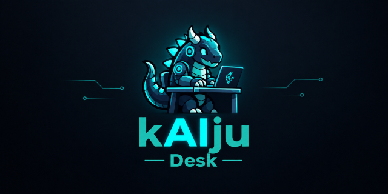

# kAIju-Desk

> A work contract between human and AI that lives in the folder.

`kaiju` is a small CLI that holds the convention you and your coding agent already
use, so neither of you has to remember it. A workspace is a folder. A task is a
subfolder with three files. The state of the task is the front-matter of its
`README.md`. There is no database, no server and no account to create.

```text
.ai/maintenance/             ← the workspace
├── kaiju.toml               ← prefix, statuses, extra fields
├── README.md                ← rules specific to this workspace (you write it)
├── BACKLOG.md               ← findings that are not tasks yet
└── MT-0001/                 ← a card
    ├── README.md            ← the request: what we want and why, plus the record
    ├── MEMORY.md            ← work trail: decisions, gotchas, dead ends
    ├── DELIVERY.md          ← what was done, result, what was left out
    └── sql/explain.sql      ← anything else is a free attachment
```

## Why

Agents read and write files well. What breaks is the convention: where each kind
of text belongs, which keys go in the front-matter, that delivery is not written
in the `README`, that an attachment never leaves the card's folder. That is
usually a README of good intentions plus discipline. `kaiju` is that discipline,
executable.

The folder is the source of truth, so a card explains itself without the tool: copy
the folder and you copied the whole task.

## Install

Requires [uv](https://docs.astral.sh/uv/). From the repository root:

```bash
uv tool install --editable ./src
kaiju --version
```

## Use

```bash
cd .ai/maintenance
kaiju init --prefix MT            # this folder becomes a workspace
kaiju guide                       # the contract, for the agent to read
kaiju add "Indexes on created_at" # folder + three files + record
kaiju status 1 in-progress
kaiju close 1 done                # fills closed_at; requires nothing else
kaiju search data_free            # regex over the whole workspace
kaiju search "" --open            # listing is a search with filters
```

| Command | What it does |
|---|---|
| `init` | turns a directory into a workspace (`kaiju.toml`, `BACKLOG.md`) |
| `guide` | prints the contract of this workspace: files, statuses, fields, backlog rules |
| `add` | allocates the next code and scaffolds the card |
| `status` / `close` / `reopen` | rewrite only the front-matter, never `MEMORY.md` or `DELIVERY.md` |
| `search` | regex over the three files, the backlog and text attachments, paginated |

`CARD` accepts the full code (`MT-0003`) or just the number (`3`).

## The rules that matter

- **Free statuses.** They are defined in `kaiju.toml`, each with a description the
  agent reads. Being closed is having `closed_at` filled, whatever the status is
  called.
- **Nothing blocks the work.** Closing a card requires no `DELIVERY.md`. The only
  refusal is on creation: a duplicate title, or an epic/parent that does not exist.
- **Epics without a new field.** A card is an epic when its `epic` is its own code
  (`kaiju add "…" --as-epic`). Other cards point at it with `--epic`.
- **Context economy.** There is no "list everything" in the terminal: `search` pages
  the output and defaults to ten lines.
- **Out of the pattern is invisible.** A folder that is not a card is ignored, not
  fixed.

## How the agent finds it

1. `kaiju.toml` in the path means the folder is a kAIju workspace (the CLI walks up
   from the current directory, like git does with `.git`).
2. `kaiju init` suggests one line for the repository's `CLAUDE.md` / `AGENTS.md`.
3. `kaiju guide` gives the agent the rest.

## Status

v0: the CLI. Python 3.10+, stdlib only at runtime (plus `tomli` below 3.11), tests
with pytest, lint with ruff. The code lives in [`src/`](src/README.md).

Planned next: a local browser viewer (`kaiju serve`) with a filtered, paginated
list and a rebuildable SQLite cache of the front-matters. The filesystem stays the
source of truth.

## Name

Jira came from *Gojira*. This one keeps the monster and puts the **AI** in the
middle of it.
